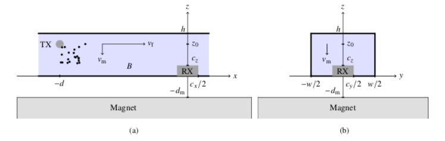
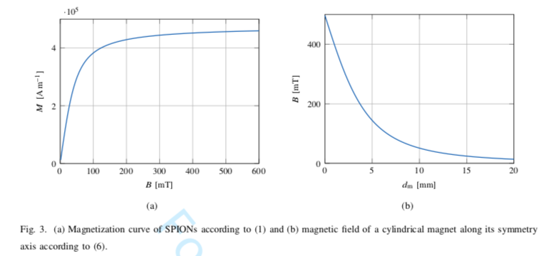
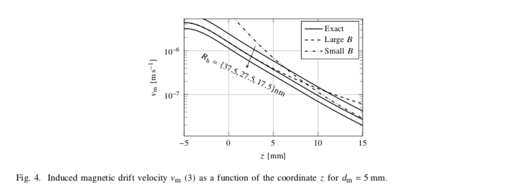
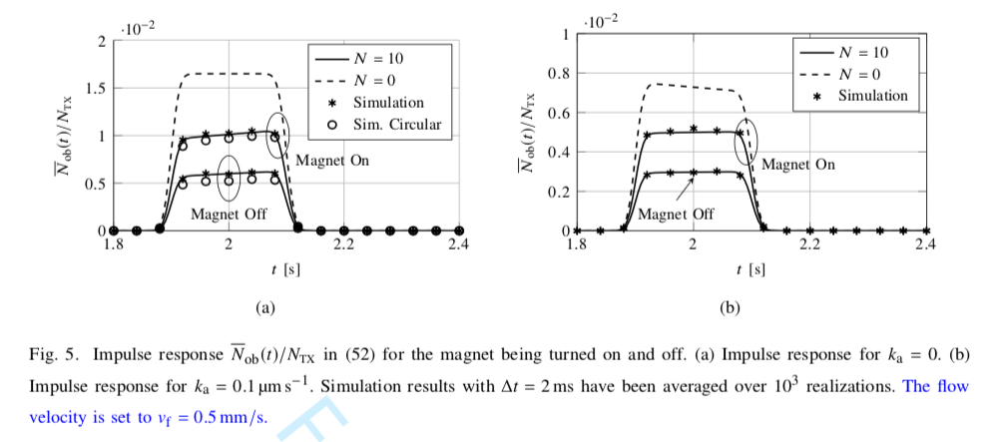
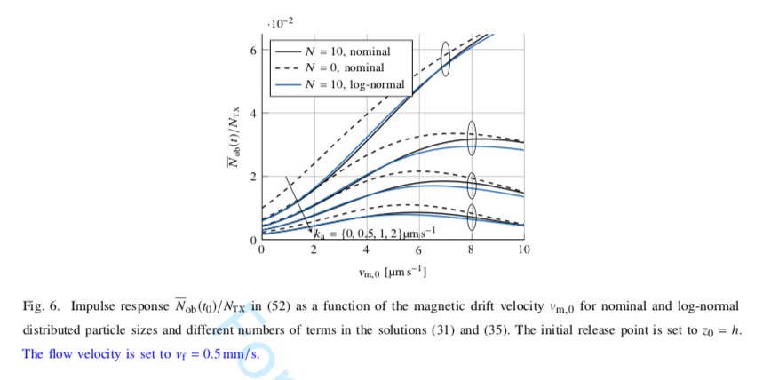
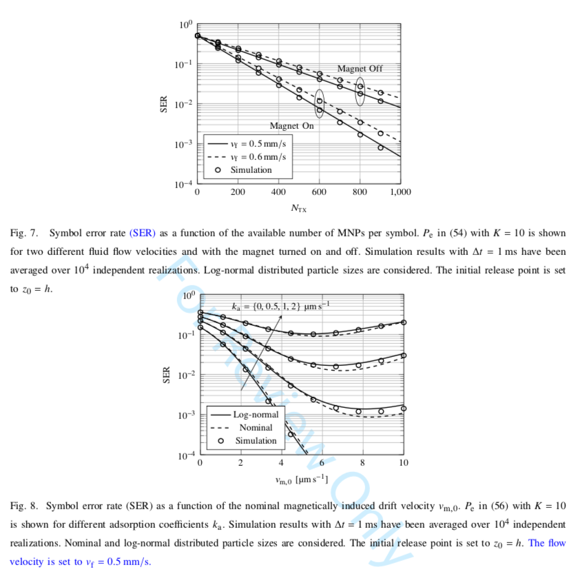

# 论文阅读笔记

[TOC]

---

#Magnetic Nanoparticle Based Molecular Communication in Microfluidic Environments

## 第一章 介绍

* 在理论上提出了一种磁性纳米分子(MNPs)
* Communication theoretic frameworks have already proven useful for analyzing natural MC systems [5].  

  * F. Tostevin and P. R. Ten Wolde, “Mutual information between input and output trajectories of biochemical networks,” Phys. Rev. Lett., vol. 102, no. 21, p. 218101, 2009. 
* 蛋白质分子通常作为信息载体，布朗运动，液体流动会减少receriver收到的通信分子。
* 通过用**磁性分子MNPs和外部磁场**解决上述问题。
* MNPs are already **widely used**[9],[10]
  - Q. A. Pankhurst, N. T. K. Thanh, S. K. Jones, and J. Dobson, “Progress in applications of magnetic nanoparticles in biomedicine,” J. Phys. D: Appl. Phys., vol. 42, no. 22, pp. 1–15, Nov. 2009
  - J. Zaloga, C. Janko, J. Nowak, J. Matuszak, S. Knaup, D. Eberbeck, R. Tietze, H. Unterweger, R. P. Friedrich, S. Duerr et al., “Development of a lauric acid/albumin hybrid iron oxide nanoparticle system with improved biocompatibility,” Int. J. Nanomed., vol. 9, p. 4847, 2014.

* 有些细菌具有天然趋磁特性，而合成的MNPs通常是被聚合物覆盖的超顺磁性铁氧纳米分子（**magenetic core & non-magenetic coating** ）

  >**Superparamagnetism** is a form of magnetism which appears in small ferromagnetic or ferrimagnetic nanoparticles. In sufficiently small nanoparticles, magnetization can randomly flip direction under the influence of temperature. The typical time between two flips is called the Néel relaxation time.

  coating来保障biocompatibility和stability，防止纳米分子凝聚，与其他分子发生反应。

* 原文，[Wiki-梯度]<https://zh.wikipedia.org/wiki/%E6%A2%AF%E5%BA%A6>

  > the magnetic force crucially depends on the magenetic field gradient rather than the magnitude of the magenetic field

* MNPs可以被attach在细胞内基因里(DNA?)[16]，装载药物[17]，attach在钙铁离子通道上[18]，细胞表面[19]，用来驱动趋磁细菌[20]，且MNPs能被磁镊精确控制，也能被精确地biosensing到。

* MC中MNPs只在第[6], [23], [24]中考虑到，[23]被attach到gene上但是没有提供数学分析。

第一张总结来说，这篇文章

* 使用MNPs为载体，将它视为内嵌化合物建模。对磁场中的运动建模。
* 为了展示使用MNPs实现MC的好处，考虑了一个直线型液态磁性环境（有cross），分析了时变下MNPs的空间分布（OOK调制）
* 对于此模型，计算了符号错误率。显示使用磁力能显著减少SER。

## 第二章 系统模型

### A. 建模

* 系统模型是三维的，高度$$h​$$，宽度$w​$，粒子只在这个管道内部扩散$$x\in ( -\infin,+ \infin), z\in[0,h], y\in[-\frac{w}{2}, \frac{w}{2}] ​$$

* 粒子可能被吸附在内壁，模型中使用常系数$k_a​$：粒子在y轴和z轴，随时间被吸附的速率（相对于边界浓度）。（不吸收边界$k_a=0​$，完全吸收边界$k_a \rightarrow \infin​$）

* 假设发射器固定在$(x,y,z) = (-d, 0, z_0)$，接收器固定在$(x,y, z) = (0,0,0)​$

* 假设液体速度平均，载动MNPs向正向$x$轴方向以速度$v_f$移动，但可能直接超过RX点。

* 考虑所有粒子都在$x\in[-\frac{c_x}{2},\frac{c_x}{2}], y\in[\frac{-c_y}{2}, \frac{c_y}{2}],z\in[0,c_z]$范围内

* 在管道底部的磁场强度$B$使粒子靠近RX，向$-z$方向移动，速度$v_m$（$v_m = 0$，传统MC）

* 磁场覆盖了TX到RX的范围

  

  

### B. 磁场动力学计算

* $N_s​$个磁性粒子(SPION)被包裹在非磁性不反应材料中，被称作一个MNP。$N_s=C_s*V_h​$
* 合成过程中MNP大小会产生差异，因此用log-normal来表示，均值$\mu_h​$，标准差$\sigma_h​$

* 外部磁场$B(z)​$仅依赖于$z​$方向，在$x​$和$y​$上平均分布，$B'(z)​$为磁场的梯度场。
* 每个MNP被磁化强度（magenitization）影响：$M(B)=M_sL(\frac{V_sM_sB}{k_BT_f})$
* $L(x) ​$ **Langevin function**：计算理想顺磁体的磁化强度。$V_s​$为MNP体积，$M_s​$为饱和磁化强度，即$M(B\rightarrow \infin) = M_s，M(B = 0) = 0​$
* 在大磁体中，$M$不仅依赖于当前$B$，以依赖于之前的$B$(磁滞)，SPION没有这个性质**(超顺磁性)**

* 给定$V_s$和平均磁化强度，包含$N_s$个SPION的MNP 在磁场强度$B$的作用下延$z$轴的力为$$F_m(z)=-N_sV_s\frac{\delta}{\delta z}(M(B(z))*B(z))$$，MNP可能会相互影响，因此$F_m$可以被表示为磁力上界
* MNP的运动速度$v_m​$由$F_m​$和布朗运动影响，扩散系数为$D​$
* MNP受到$F_m​$的力，同时浸泡在粘滞度为 $ \eta ​$ 的液体中，$v_m = \frac{F_m}{\zeta}​$，$\zeta = 6\pi\eta R_h​$ (Stokes' law)，因此可以得到 $$v_m(z) = -R_h^2C_s\frac{2V_s}{9\eta}\frac{\delta}{\delta z}(M(B(z))*B(z))​$$（忽略加速过程）
* 在流体运动和磁力叠加下，粒子总速度为$$(v_f,0,v_m)$$
* $$v_m=\begin{cases} -R_h^2C_s\frac{4V_s}{9\eta}\propto B(z)B'(z) \quad B\ small \\ -R_h^2C_s\frac{2V_s}{9\eta}M_sB'(z) \quad B\ large\end{cases}​$$  磁场提供的速度很依赖于$B'(z)​$
* 由热力学，$\zeta​$ 与$D​$相关联，$k_BT_f=D\zeta​$，所以给定粘滞度$\zeta​$和液体温度$T_f​$，$$D=\frac{k_BT_f}{6\pi  \eta R_h}​$$

### C. 磁场强度计算

考虑一个对称型的圆柱形磁铁，长度$L_{mag}$，半径$R_{mag}​$，则

$$B(z) = \frac{B_0}{2}(\frac{z+d_M+L_{mag}}{\sqrt{(z+d_M+L_{mag})^2+R^2_{mag}}}-\frac{z+d_m}{\sqrt{(z+d_m)^2+R^2_{mag}}})​$$

* $B_0​$是系统参数，反应磁铁的性质，那么$$B'(z)=\frac{B_0}{2}(\frac{R^2_{mag}}{((z+d_M+L_{mag})^2+R^2_{mag})^2}-\frac{R^2_{mag}}{ ((z+d_m)^2+R^2_{mag})^{3/2}})​$$

* $R_{mag} >> d,w​$时上述方程已经足够表述信道里的磁场性质。
* 因为$h$很小，对于$z\in[0,h]$可以假设$B(z)$和$B'(z)$是常数，因此$v_m(z)$设也是常数

### D. 调制和检测

二进制符号$b[i]$使用OOK调制。TX在时隙$T$瞬间释放$N_{TX}$个和0个MNP，分别表示$b[i]=1$，$b[i]=0$

* 假设RX与TX同步，i.e.知道$T​$以及时隙的开始和结束时刻
* 通过$iT+t_0$的粒子数量采样，每个时隙采样到$n_{RX}[i]$个粒子与阈值$\xi​$

$$\hat{b}[i] = \begin{cases}0, \quad n_{RX}<\xi \\ 1,\quad n_{RX}\ge\xi\end{cases}$$

## 第三章 信道性能分析

分析单粒子在时变情况下的空间分布，通过空间概率密度函数，计算一个大小$R_h$的粒子在$RX$体积中的概率，这章至考虑一个体积为$R_h$的粒子

### A. 格林方程(Green's Function)

由于粒子在x,y,z轴方向的运动是独立的，因此时变PDF可以写成$$p(x,y,z;t)=p_x(x;t)p_y(y;t)p_z(z;t)$$

* 在x轴上符合无边界环境，且漂移常数$v_f$，所以x轴上的分布可由[36]得到

  $$p_x(x;t) = \frac{1}{\sqrt{4D\pi t}}exp(\frac{-(x+d-v_ft)^2}{4Dt})​$$

* x轴上均值$$\overline{x}(t)=-d+v_ft$$，到达RX中心的时间$$t_1=d/v_f​$$

* z轴上分布比较难以计算，因为是bounded环境，如果得到了z轴分布，那么y轴分布也很容易得到，去掉磁场的部分就行了。

* 计算$p_z(z;t)$,首先需要计算一个带边界和drift的扩散方程的PDE

* 带drift和边界的扩散方程：$$\frac{\delta}{\delta t}p_z = -\frac{\delta}{\delta z}J_z​$$， $$J_z​$$是概率通量，由2个部分组成，一个是扩散部分，一个是受到磁力影响的运动

* $$J_z(z;t)=-D\frac{\delta}{\delta z}p_z(z;t)-v_mp_z(z;t)$$，受边界吸收可被表示为$$J_z(z;t)=k_ap_z(z;t)$$

* 列出了PDE，但是解不出来。因此使用级数接近。

**接下来已经看不懂了，反正乱算了一通可以得到**

* $$p_z(z;t)=exp(-u(z-z_0)-Du^2t)*[\sum_{n=0}^Na_nexp(-Ds_n^2t)Z_n(z)]​$$

* $$p_y(y;t)=\sum_{n=0}^Nb_nexp(-D{o_n^2})Y_n(y)​$$

* $$Z_n(z)​$$（15），$Y_n(y)​$（25）

### B. 粒子观测概率

使用$p(x,y,z;t)$可以得到在RX体积内观测到粒子的概率$P_{ob}(t)$

* $$P_{ob}(t) = \int_{-c_x/2}^{c_x/2} \int_{-c_y/2}^{c_y/2}  \int_{0}^{c_z}p(x,y,z;t)dzdydx=P_{ob,x}(t)P_{ob,y}(t)P_{ob,z}(t)​$$
* 把y,z轴积分得到：$P_{ob,x}(t)=\frac{1}{2}[erf(\frac{\overline{x}+\frac{1}{2}c_x}{\sqrt{4Dt}})-erf(\frac{\overline{x}-\frac{1}{2}c_x}{\sqrt{4Dt}})]​$，erf是error function
* **乱算一通**得到$P_{ob,y}(t)$和$P_{ob,z}(t)$
* 考虑了几种特殊情况，**渐进行为(?)**，边界完全反弹，边界完全吸收下的观测概率

##  第四章 数值分析

得到“所观察到的粒子”数目后，把它当作“**信道脉冲**”，这是随时间变化的量，然后计算接收信号强度和SER

### A. 粒子数值

* $v_m = v_{m,0}(\frac{R_h}{\mu_h})^2$，也是log-normal分布，同样$D=D_0\frac{\mu_h}{R_h}$

### B. 脉冲反馈

观测概率期望$E\{P_{ob}(t)\} = \int^\infin_0P_{ob}(t;r)*f_{R_h}(r)dr​$，$f_{R_h}(r)​$是log-form的概率密度函数

所以有$\overline{N}_{ob}(t)=N_{TX}*E\{P_{ob}(t)\}$，作为信道的脉冲反馈(**impulse response**)，这个积分又算不出来，使用蒙特卡洛方法：$\overline{N}_{ob}(t)=\sum_{i=1}^{N_{TX}}P_{ob,i}(t)$

### C. SER计算

由前面可知$$\overline{n}_{RX}[i]=\sum_{j=0}^ib[j]\overline{N}_{ob}((i-j)T+t_0)$$

由于扩散效应和码间干扰，可计算发送$K​$个符号的平均SER：$$P_e=\frac{1}{2^K}\sum_{b\in B(K)}[\frac{1}{K}\sum_{i=0}^{K-1}Pr(\hat{b}[i] \ne b[i];b[j\le i])]​$$

* $B(K)$是$2^K$个可能的二进制序列集合

* $Pr(\hat{b}[i]\ne b[i];b[j\le i])​$表示序列中$b[i]​$传输错误的概率

* $Pr(\hat{b}[i]\ne b[i];b[j\le i]) = \begin{cases}p_\xi(b[j\le i]),\quad b[i]=1 \\ 1-p_\xi(b[j\le i]),\quad b[i]=0\end{cases}$

* $p_\xi(b[j\le i]) = Pr(n_{RX}[i]<\xi;b[j\le i ])$

* $n_{RX}[i]$可以被泊松随机变量很好地刻画，$p_\xi$则是泊松累计函数$F(\xi-1;\overline{n}_{RX}[i])$在均值$\overline{n}_{RX}[i]$和$\xi-1$处地取直

* 由于流体流速使粒子不能在RX停留，$T$足够大就没有码间干扰，$b[i]=0$一定能被正确接收。阈值$\xi$有一个最佳取值，所以没有码间干扰的情况下，$\xi=1$使$P_e$最小。

  此时$$P_e= \frac{1}{2}e^{-\overline{N}_{ob}(t_0)}$$

* 之后就不计算码间干扰

## 第五章 数值仿真结果

* 不考虑计算复杂度
* 

* 吸收常数$k_a$和信道边界吸收粒子概率$P_ad$存在一个数值关系
* 对一个单独SPION施加磁场得到的速度
* 

* 

* 

* 

## 第六章 结论

* 使用MNP作为MC信息载体
* 对MNP的扩散和drift建模
* 磁力带来的速度受磁场强度梯度影响
* 强调了粒子体积对漂移速度和扩散系数的影响
* 计算了不同粒子大小对脉冲反馈的影响
* 数值仿真了log-form粒子分布和边界吸收效应如何影响脉冲反馈，发现了RX的接收能力与边界吸收能力的trade off
* 最后，计算了SER，不同液体流速对SER的影响，外加磁场保证了更可靠的通信。

---

# Biosensing-by-learning Direct Targeting Strategy for Enhanced Tumor Sensitization

## 第一章 介绍

* MNP在MRI中通常提供更清楚的轮廓。
* 梯度下降的DST（Direct Targeting Strategy）
* MNP的尺寸在50-100nm，铁氧化合物[16]

* 磁场驱动的MNP需要先验知识：目的地点在哪里

## 第二章 外部测量函数

* 用纳米机在环境内测量形成外部映射函数，得到梯度信息。

### A. 环境敏感的纳米系统(Environment-responsive)

* 毛细血管在人体组织中基本都是均匀分布的，为了运输氧气和养料[33]-[35]
* 肿瘤中的毛细血管流速总是显著地慢于正常组织中的流速
* 通过纳米机的运动速度和轨迹上的曲折程度得到外部测量函数

### B. 环境引导的纳米系统(Environment-primed)

* gold nanorod注入人体后通过长时间血液循环会累积在肿瘤附近，同时会使肿瘤附近升温，所以肿瘤附近血液流速升高，形成温度梯度

## 第三章 迭代DTS

### A. 基于入侵渗流的多层血管网模型

* 肿瘤的血管更加地"chaotic"，可以用分形几何进行描述（分形维度不一样）
* 肿瘤表面的毛细血管更多，中心区域更少。

### B. 问题描述

* $f​$表示外部描述函数，定义域是$  \mathscr {D}​$, $G​$是猜测区域
* $$f(\overrightarrow{x}; G) = f_A(\overrightarrow{x};G)+f_C(\overrightarrow{x};G)​$$
* $$f(\overrightarrow{x}; G) = f_T(\overrightarrow{x})+f_D(\overrightarrow{x};G) +f_C(\overrightarrow{x};G), \overrightarrow{x}\in  \mathscr {D}$$

