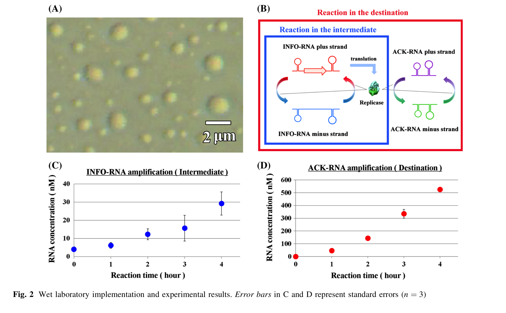

#  论文阅读笔记

[TOC]

---

#Magnetic Nanoparticle Based Molecular Communication in Microfluidic Environments

## 第一章 介绍

* 在理论上提出了一种磁性纳米分子(MNPs)
* Communication theoretic frameworks have already proven useful for analyzing natural MC systems [5].  

  * F. Tostevin and P. R. Ten Wolde, “Mutual information between input and output trajectories of biochemical networks,” Phys. Rev. Lett., vol. 102, no. 21, p. 218101, 2009. 
* 蛋白质分子通常作为信息载体，布朗运动，液体流动会减少receriver收到的通信分子。
* 通过用**磁性分子MNPs和外部磁场**解决上述问题。
* MNPs are already **widely used**[9],[10]
  - Q. A. Pankhurst, N. T. K. Thanh, S. K. Jones, and J. Dobson, “Progress in applications of magnetic nanoparticles in biomedicine,” J. Phys. D: Appl. Phys., vol. 42, no. 22, pp. 1–15, Nov. 2009
  - J. Zaloga, C. Janko, J. Nowak, J. Matuszak, S. Knaup, D. Eberbeck, R. Tietze, H. Unterweger, R. P. Friedrich, S. Duerr et al., “Development of a lauric acid/albumin hybrid iron oxide nanoparticle system with improved biocompatibility,” Int. J. Nanomed., vol. 9, p. 4847, 2014.

* 有些细菌具有天然趋磁特性，而合成的MNPs通常是被聚合物覆盖的超顺磁性铁氧纳米分子（**magenetic core & non-magenetic coating** ）

  >**Superparamagnetism** is a form of magnetism which appears in small ferromagnetic or ferrimagnetic nanoparticles. In sufficiently small nanoparticles, magnetization can randomly flip direction under the influence of temperature. The typical time between two flips is called the Néel relaxation time.

  coating来保障biocompatibility和stability，防止纳米分子凝聚，与其他分子发生反应。

* 原文，[Wiki-梯度]<https://zh.wikipedia.org/wiki/%E6%A2%AF%E5%BA%A6>

  > the magnetic force crucially depends on the magenetic field gradient rather than the magnitude of the magenetic field

* MNPs可以被attach在细胞内基因里(DNA?)[16]，装载药物[17]，attach在钙铁离子通道上[18]，细胞表面[19]，用来驱动趋磁细菌[20]，且MNPs能被磁镊精确控制，也能被精确地biosensing到。

* MC中MNPs只在第[6], [23], [24]中考虑到，[23]被attach到gene上但是没有提供数学分析。

第一张总结来说，这篇文章

* 使用MNPs为载体，将它视为内嵌化合物建模。对磁场中的运动建模。
* 为了展示使用MNPs实现MC的好处，考虑了一个直线型液态磁性环境（有cross），分析了时变下MNPs的空间分布（OOK调制）
* 对于此模型，计算了符号错误率。显示使用磁力能显著减少SER。

## 第二章 系统模型

### A. 建模

* 系统模型是三维的，高度$$h$$，宽度$w$，粒子只在这个管道内部扩散$$x\in ( -\infin,+ \infin), z\in[0,h], y\in[-\frac{w}{2}, \frac{w}{2}] $$

* 粒子可能被吸附在内壁，模型中使用常系数$k_a$：粒子在y轴和z轴，随时间被吸附的速率（相对于边界浓度）。（不吸收边界$k_a=0$，完全吸收边界$k_a \rightarrow \infin$）

* 假设发射器固定在$(x,y,z) = (-d, 0, z_0)$，接收器固定在$(x,y, z) = (0,0,0)$

* 假设液体速度平均，载动MNPs向正向$x$轴方向以速度$v_f$移动，但可能直接超过RX点。

* 考虑所有粒子都在$x\in[-\frac{c_x}{2},\frac{c_x}{2}], y\in[\frac{-c_y}{2}, \frac{c_y}{2}],z\in[0,c_z]$范围内

* 在管道底部的磁场强度$B$使粒子靠近RX，向$-z$方向移动，速度$v_m$（$v_m = 0$，传统MC）

* 磁场覆盖了TX到RX的范围

  

  

### B. 磁场动力学计算

* $N_s$个磁性粒子(SPION)被包裹在非磁性不反应材料中，被称作一个MNP。$N_s=C_s*V_h$
* 合成过程中MNP大小会产生差异，因此用log-normal来表示，均值$\mu_h$，标准差$\sigma_h$

* 外部磁场$B(z)$仅依赖于$z$方向，在$x$和$y$上平均分布，$B'(z)$为磁场的梯度场。
* 每个MNP被磁化强度（magenitization）影响：$M(B)=M_sL(\frac{V_sM_sB}{k_BT_f})$
* $L(x) $ **Langevin function**：计算理想顺磁体的磁化强度。$V_s$为MNP体积，$M_s$为饱和磁化强度，即$M(B\rightarrow \infin) = M_s，M(B = 0) = 0$
* 在大磁体中，$M$不仅依赖于当前$B$，以依赖于之前的$B$(磁滞)，SPION没有这个性质**(超顺磁性)**

* 给定$V_s$和平均磁化强度，包含$N_s$个SPION的MNP 在磁场强度$B$的作用下延$z$轴的力为$$F_m(z)=-N_sV_s\frac{\delta}{\delta z}(M(B(z))*B(z))$$，MNP可能会相互影响，因此$F_m$可以被表示为磁力上界
* MNP的运动速度$v_m$由$F_m$和布朗运动影响，扩散系数为$D$
* MNP受到$F_m$的力，同时浸泡在粘滞度为 $ \eta $ 的液体中，$v_m = \frac{F_m}{\zeta}$，$\zeta = 6\pi\eta R_h$ (Stokes' law)，因此可以得到 $$v_m(z) = -R_h^2C_s\frac{2V_s}{9\eta}\frac{\delta}{\delta z}(M(B(z))*B(z))$$（忽略加速过程）
* 在流体运动和磁力叠加下，粒子总速度为$$(v_f,0,v_m)$$
* $$v_m=\begin{cases} -R_h^2C_s\frac{4V_s}{9\eta}\propto B(z)B'(z) \quad B\ small \\ -R_h^2C_s\frac{2V_s}{9\eta}M_sB'(z) \quad B\ large\end{cases}$$  磁场提供的速度很依赖于$B'(z)$
* 由热力学，$\zeta$ 与$D$相关联，$k_BT_f=D\zeta$，所以给定粘滞度$\zeta$和液体温度$T_f$，$$D=\frac{k_BT_f}{6\pi  \eta R_h}$$

### C. 磁场强度计算

考虑一个对称型的圆柱形磁铁，长度$L_{mag}$，半径$R_{mag}$，则

$$B(z) = \frac{B_0}{2}(\frac{z+d_M+L_{mag}}{\sqrt{(z+d_M+L_{mag})^2+R^2_{mag}}}-\frac{z+d_m}{\sqrt{(z+d_m)^2+R^2_{mag}}})$$

* $B_0$是系统参数，反应磁铁的性质，那么$$B'(z)=\frac{B_0}{2}(\frac{R^2_{mag}}{((z+d_M+L_{mag})^2+R^2_{mag})^2}-\frac{R^2_{mag}}{ ((z+d_m)^2+R^2_{mag})^{3/2}})$$

* $R_{mag} >> d,w$时上述方程已经足够表述信道里的磁场性质。
* 因为$h$很小，对于$z\in[0,h]$可以假设$B(z)$和$B'(z)$是常数，因此$v_m(z)$设也是常数

### D. 调制和检测

二进制符号$b[i]$使用OOK调制。TX在时隙$T$瞬间释放$N_{TX}$个和0个MNP，分别表示$b[i]=1$，$b[i]=0$

* 假设RX与TX同步，i.e.知道$T$以及时隙的开始和结束时刻
* 通过$iT+t_0$的粒子数量采样，每个时隙采样到$n_{RX}[i]$个粒子与阈值$\xi$

$$\hat{b}[i] = \begin{cases}0, \quad n_{RX}<\xi \\ 1,\quad n_{RX}\ge\xi\end{cases}$$

## 第三章 信道性能分析

分析单粒子在时变情况下的空间分布，通过空间概率密度函数，计算一个大小$R_h$的粒子在$RX$体积中的概率，这章至考虑一个体积为$R_h$的粒子

### A. 格林方程(Green's Function)

由于粒子在x,y,z轴方向的运动是独立的，因此时变PDF可以写成$$p(x,y,z;t)=p_x(x;t)p_y(y;t)p_z(z;t)$$

* 在x轴上符合无边界环境，且漂移常数$v_f$，所以x轴上的分布可由[36]得到

  $$p_x(x;t) = \frac{1}{\sqrt{4D\pi t}}exp(\frac{-(x+d-v_ft)^2}{4Dt})$$

* x轴上均值$$\overline{x}(t)=-d+v_ft$$，到达RX中心的时间$$t_1=d/v_f$$

* z轴上分布比较难以计算，因为是bounded环境，如果得到了z轴分布，那么y轴分布也很容易得到，去掉磁场的部分就行了。

* 计算$p_z(z;t)$,首先需要计算一个带边界和drift的扩散方程的PDE

* 带drift和边界的扩散方程：$$\frac{\delta}{\delta t}p_z = -\frac{\delta}{\delta z}J_z$$， $$J_z$$是概率通量，由2个部分组成，一个是扩散部分，一个是受到磁力影响的运动

* $$J_z(z;t)=-D\frac{\delta}{\delta z}p_z(z;t)-v_mp_z(z;t)$$，受边界吸收可被表示为$$J_z(z;t)=k_ap_z(z;t)$$

* 列出了PDE，但是解不出来。因此使用级数接近。

**接下来已经看不懂了，反正乱算了一通可以得到**

* $$p_z(z;t)=exp(-u(z-z_0)-Du^2t)*[\sum_{n=0}^Na_nexp(-Ds_n^2t)Z_n(z)]$$

* $$p_y(y;t)=\sum_{n=0}^Nb_nexp(-D{o_n^2})Y_n(y)$$

* $$Z_n(z)$$（15），$Y_n(y)$（25）

### B. 粒子观测概率

使用$p(x,y,z;t)$可以得到在RX体积内观测到粒子的概率$P_{ob}(t)$

* $$P_{ob}(t) = \int_{-c_x/2}^{c_x/2} \int_{-c_y/2}^{c_y/2}  \int_{0}^{c_z}p(x,y,z;t)dzdydx=P_{ob,x}(t)P_{ob,y}(t)P_{ob,z}(t)$$
* 把y,z轴积分得到：$P_{ob,x}(t)=\frac{1}{2}[erf(\frac{\overline{x}+\frac{1}{2}c_x}{\sqrt{4Dt}})-erf(\frac{\overline{x}-\frac{1}{2}c_x}{\sqrt{4Dt}})]$，erf是error function
* **乱算一通**得到$P_{ob,y}(t)$和$P_{ob,z}(t)$
* 考虑了几种特殊情况，**渐进行为(?)**，边界完全反弹，边界完全吸收下的观测概率

##  第四章 数值分析

得到“所观察到的粒子”数目后，把它当作“**信道脉冲**”，这是随时间变化的量，然后计算接收信号强度和SER

### A. 粒子数值

* $v_m = v_{m,0}(\frac{R_h}{\mu_h})^2$，也是log-normal分布，同样$D=D_0\frac{\mu_h}{R_h}$

### B. 脉冲反馈

观测概率期望$E\{P_{ob}(t)\} = \int^\infin_0P_{ob}(t;r)*f_{R_h}(r)dr$，$f_{R_h}(r)$是log-form的概率密度函数

所以有$\overline{N}_{ob}(t)=N_{TX}*E\{P_{ob}(t)\}$，作为信道的脉冲反馈(**impulse response**)，这个积分又算不出来，使用蒙特卡洛方法：$\overline{N}_{ob}(t)=\sum_{i=1}^{N_{TX}}P_{ob,i}(t)$

### C. SER计算

由前面可知$$\overline{n}_{RX}[i]=\sum_{j=0}^ib[j]\overline{N}_{ob}((i-j)T+t_0)$$

由于扩散效应和码间干扰，可计算发送$K$个符号的平均SER：$$P_e=\frac{1}{2^K}\sum_{b\in B(K)}[\frac{1}{K}\sum_{i=0}^{K-1}Pr(\hat{b}[i] \ne b[i];b[j\le i])]$$

* $B(K)$是$2^K$个可能的二进制序列集合

* $Pr(\hat{b}[i]\ne b[i];b[j\le i])$表示序列中$b[i]$传输错误的概率

* $Pr(\hat{b}[i]\ne b[i];b[j\le i]) = \begin{cases}p_\xi(b[j\le i]),\quad b[i]=1 \\ 1-p_\xi(b[j\le i]),\quad b[i]=0\end{cases}$

* $p_\xi(b[j\le i]) = Pr(n_{RX}[i]<\xi;b[j\le i ])$

* $n_{RX}[i]$可以被泊松随机变量很好地刻画，$p_\xi$则是泊松累计函数$F(\xi-1;\overline{n}_{RX}[i])$在均值$\overline{n}_{RX}[i]$和$\xi-1$处地取直

* 由于流体流速使粒子不能在RX停留，$T$足够大就没有码间干扰，$b[i]=0$一定能被正确接收。阈值$\xi$有一个最佳取值，所以没有码间干扰的情况下，$\xi=1$使$P_e$最小。

  此时$$P_e= \frac{1}{2}e^{-\overline{N}_{ob}(t_0)}$$

* 之后就不计算码间干扰

## 第五章 数值仿真结果

* 不考虑计算复杂度
* 

* 吸收常数$k_a$和信道边界吸收粒子概率$P_ad$存在一个数值关系
* 对一个单独SPION施加磁场得到的速度
* 

* 

* 

* 

## 第六章 结论

* 使用MNP作为MC信息载体
* 对MNP的扩散和drift建模
* 磁力带来的速度受磁场强度梯度影响
* 强调了粒子体积对漂移速度和扩散系数的影响
* 计算了不同粒子大小对脉冲反馈的影响
* 数值仿真了log-form粒子分布和边界吸收效应如何影响脉冲反馈，发现了RX的接收能力与边界吸收能力的trade off
* 最后，计算了SER，不同液体流速对SER的影响，外加磁场保证了更可靠的通信。

---

# Biosensing-by-learning Direct Targeting Strategy for Enhanced Tumor Sensitization

## 第一章 介绍

* MNP在MRI中通常提供更清楚的轮廓。
* 梯度下降的DST（Direct Targeting Strategy）
* MNP的尺寸在50-100nm，铁氧化合物[16]

* 磁场驱动的MNP需要先验知识：目的地点在哪里

## 第二章 外部测量函数

* 用纳米机在环境内测量形成外部映射函数，得到梯度信息。

### A. 环境敏感的纳米系统(Environment-responsive)

* 毛细血管在人体组织中基本都是均匀分布的，为了运输氧气和养料[33]-[35]
* 肿瘤中的毛细血管流速总是显著地慢于正常组织中的流速
* 通过纳米机的运动速度和轨迹上的曲折程度得到外部测量函数

### B. 环境引导的纳米系统(Environment-primed)

* gold nanorod注入人体后通过长时间血液循环会累积在肿瘤附近，同时会使肿瘤附近升温，所以肿瘤附近血液流速升高，形成温度梯度

## 第三章 迭代DTS

### A. 基于入侵渗流的多层血管网模型

* 肿瘤的血管更加地"chaotic"，可以用分形几何进行描述（分形维度不一样）
* 肿瘤表面的毛细血管更多，中心区域更少。

### B. 问题描述

* $f$表示外部描述函数，定义域是$  \mathscr {D}$, $G$是猜测区域
* $$f(\overrightarrow{x}; G) = f_A(\overrightarrow{x};G)+f_C(\overrightarrow{x};G)$$
* $$f(\overrightarrow{x}; G) = f_T(\overrightarrow{x})+f_D(\overrightarrow{x};G) +f_C(\overrightarrow{x};G), \overrightarrow{x}\in  \mathscr {D}$$

# Chemotactic-based Target Detection Scheme in a Multiple-hop Relay Nano-network

## 第一章 介绍

* 沙门氏菌对于肿瘤的排放物具有高度趋化性。
* 基于single-hop模型设计了multi-hop系统模型，需要用到多种趋化物质。

## 第二章 系统模型

* one-hop模型
  * 对于中继节点：一旦发现趋化物质A，停止运动，释放物质B1
  * 对于纳米机：如果探测到物质A，朝A的高浓度方向运动；若没探测到A，但探测到B1，朝B1浓度高的方向运动；都没探测到，随机运动。
* two-hop模型：需要中继节点能释放至少两种趋化物质，纳米机能够区分三种趋化物质。

## 第三章 数学模型

假设：

1. 2D平面有界环境 $L*L$
2. 目标区域$E_T(\in E)$
3. 如果纳米机运动到边界，反射进入环境
4. 不考虑纳米机碰撞

# Performance Analysis for Cooperative Relaying in Diffusion-Based Molecular Communication

## 第一章 介绍

* 传统的中继策略包括
  * 解码转发(decode-and-forward, DF)：解码收到的信息，重新编码再发送。可以减少噪声水平，但信道质量不好时误码率堪忧。
  * 放大转发(amplify-and-forward, AF)：直接放大转发。也同时放大了信道噪声，在信道质量不好的信道中能取得更好效果。
  * 降噪转发(genoise-and-forward,  DNF)
* 提出了一种协同中继策略，结合了AF和DF的优势。被称为**解码放大中继(decide-amplify-foward, ODAF)**
* 在ODAF中，使用均值方差(MSE)来对中继和接收节点做决策。通过误码率分析去衡量中继策略的性能。

## 第二章 系统模型

* 三个纳米机，$S, D, R$。分布在三维空间中。
* 采用ASK进行信号调制。
* 节点$S$通过在一个时隙里释放$N_1, N_0$来表达二进制中的$1,0$
* 考虑了码间干扰ISI，且长度为$I$
* 接收机处浓度 $y(\overrightarrow{r}, t) = \sum_{i=0}^{I} C_{a^{k-i}}(\overrightarrow{r}, t+iT) + n(t)$
* $a^{k}$：二进制message汇总第$k$个interval
* $n(t)$：噪声，符合分布$n(t) \sim \mathcal{N}(0, \sum_{i=0}^{I}C_{a^{k-i}}, i / V_R)$
* 系统在一个时隙内采样，或观测浓度$M$ 次，因此$y = \sum_{i=0}^{I} \sum_{m=1}^{M}C_{a^{k-i}}(\overrightarrow r, t_m+iT)+n(t)$
* $y = \sum_{i=0}^{I} C_{a^{k-i},i}+n(t)$

## 第三章 中继信道性能分析

* 这一章里对AF, DF, ODAF进行BER分析，并考虑使用同种分子(same type molecules, STM)和不同种类分子(different type molecules, DTM)进行调制。

# A Novel Experimental Platform for In-Vessel Multi-Chemical Molecular Communications

## 第一章 介绍

* 搭建了一个实验平台，通过注射酸和碱，把信息编码在pH值中，成本低。
* 解码困难，设计了基于SVM和RNN的解码器，因此需要数据进行“训练”，去熟悉信道模型。其中RNN解码器的表现十分接近于最大似然解码器(Maximum Likelihood, ML)。RNN的效果好于10倍的Slope解码，好于SVM解码器两倍。使信道速率从0.3bps扩大到4bps

## 第二章 多化合物实验平台

* 除了使用酸碱，还可以使用蛋白质，葡萄糖和酶（有对应传感器），
* 发射器端使用了旋转泵（ peristaltic pump），可以从多个容器中抽出液体
* 传输信道是硅管，直径2.5毫米，一直使用清水注射，大概1.3ml/s，pH在7到8.5之间
* 接收端使用pH探针，pH表， Arduino Uno和电脑，使用pH的好处是，电压和pH是线性关系。

## 第三章 基于实验平台的通信系统

* 分为两个部分，第一个是调制和协议，第二个是检测和解调。

* 调制和协议

  * 采用time-slotted，每一个时隙30ms，在这段时间里注射酸或碱代表0和1。但是存在一个guard band，分别是220ms, 304ms,  350ms, 470ms代表4, 3, 2.6, 2bps。
  * 为了同步发送端和接收端，每一段消息序列开头使用100ms的酸注射和900ms静止时间

* 基于速率变化的符号检测

  * 将pH值的变化率作为baseline和其他方法进行对比
  * 把每一个interval平均分成9个sub-interval，用均值作为这个sub-interval的pH,可以检测8次变化率
  * 从2bps到4bps的结果如下，随速率上升，ISI更明显，最好的阈值时0，最好的决策bin是第8次pH变化

  

  

* 基于机器学习的符号检测（SVM和RNN）
  * $x$为发送比特，$\mathbf{s}$为d维接收到的信号向量，$\mathbf{y}$为解调$\mathbf{s}$后的长度为$m$信号，$\varphi: \mathcal{R}^d \mapsto \mathcal{R}^m$是解调函数
  * 基于SVM的解调器
    * 考虑线性回归 $\widehat{x} = \mathbf{w}^T \mathbf{y} + b$ ，$\mathbf{w}$是系数权重，$b$为基，通过一组训练数据 $\{ (x_1, \mathbf{y_1}), \cdots , (x_n, \mathbf{y_n})\}$ ，找到一组$\mathbf{w}$和$b$使得它在训练集上平方误差最小
    * 由于发送信号和接收信号是非线性关系，因此使用SVM把特征空间映射到更高维，映射由函数$\phi(\mathbf{y})$完成
    * 两个采样的核函数定义：$k(\mathbf{y_i}, \mathbf{y_j})= \phi(\mathbf{y_i}) ^T\phi(\mathbf{y_j})$
    * 定义$\widehat{x}'_i = 2x_i-1$
    * 通过上述定义，可以把线性回归转换成$\widehat{x}' = sgn(\mathbf{w}^T\phi(\mathbf{y})+b) = sgn(b + \sum_{i=1}^n\alpha_ix_i'k(\mathbf{y,y_i}))$, $i$是训练集训练数据的下标，$\alpha_i$是对应数据的权重，然后这个问题转化成了凸优化。使用**高斯核函数**
  * 基于RNN的解调器
    * 看不懂

## 第四章 实验结果与结论

* SVM和RNN的效果显著好于baseline，RNN好于SVM

* 做了194次实验，每次随机传输120个比特，20%的数据用于训练，80%用于检测。给出了基于SVM的最好$\sigma$和RNN最好的LSTM参数。

  

# Design and wet-laboratory implementation of reliable end-to-end molecular communication

## 第一章 介绍

* 这个湿实验的主要特征是，中间节点具有复制包(packet)的能力，中间节点一旦检测到packet就复制这个packet，接收节点收到packet后产生一个ack packet回复。

## 第二章 通信系统设计

* 包括source, intermediate, destination三个节点。source产生包和传输，中间节点产生包的复制，终点产生收到包后产生ACK回传给源。
* Molecular packet的Header里包含控制信息，如源地址，目的地址，错误代码(Hamming code)，序列号。如果Data部分为空则是一个ACK。
* packet信息都编码在DNA或RNA序列中（本论文使用RNA和人造细胞）

## 第三章 湿实验实现

* 每一个nanomachie都是A图中的一个小水滴，由water-in-oil emulsion （油包水乳液）组成。它是一种微米级别的水滴在油中的分布，每一个小水滴都被单层的油状的表面活性剂分隔开。

* 每一个nanomachine都是通过一个叫“PURE” 的系统实现的。

  > Ichihashi, N., Usui, K., Kazuta, Y., Sunami, T., Matsuura, T., &
  > Yomo, T. (2013). Darwinian evolution in a translation-coupled
  > RNA replication system within a cell-like compartment. Nature
  > Communications, 4, 2494.
  >
  > Shimizu, Y., Inoue, A., Tomari, Y., Suzuki, T., Yokogawa, T., Nishikawa, K., et al. (2001). Cell-free translation reconstituted with purified components. Nature Biotechnology, 19, 751–755. 

* INFO-RNA是一个RNA序列，用来编码RNA复制酶，通过互补链合成复制INFO-RNA，小水滴中包含了蛋白质翻译的必须元件（核糖体，氨基酸）。INFO-RNA通过复制酶的翻译，递归复制。

* ACK-RNA可以有INFO-RNA编码的复制酶复制，但它本身不编码复制酶。当INFO-RNA和ACK-RNA共存于纳米机时，预期优先翻译ACK-RNA，因为它长度更短，复制更快。

  >知识补充：
  >
  >RNA，核糖核酸，线性大分子，由A, G, C , U四种碱基组成。

* 图B中是中间节点的生化反应过程，但此文章在实验最开始，中间节点和目的都包含了INFO-RNA，没有设计RNA交换的过程。

* 使用10$\mu l$ PURE系统的RNAs滴在1ml的油与表面活性剂中，冷冻状态下16000rpm离心一分钟

* 在37度下孵化活性剂4小时，每隔一小时挑选小部分冷冻储藏。

* 解冻每部分的储藏活性剂，测量INFO-RNA的浓度。

* 对于ACK-RNA，滴10 $\mu l$的 PURE液滴，同时包含INFO-RNA和ACK-RNA，其余步骤相同。

* 经4小时的复制，中间节点的INFO-RNA浓度方大7倍，终点的ACK-RNA放大1900倍。INFO-RNA的长度是ACK-RNA的10倍以上。

## 第四章 性能分析

* 通过设置不同的中间节点数量和环境尺寸，去计算传输时延（蒙特卡洛模拟）。

* 随着中间节点的增加，传输时延不断降低。
* one-way和round-trip的通信成功率没有显著区别。
* 随着通信环境尺寸的增大，如果中间节点数量不足，通信成功率显著降低，round-trip比one-way更低。

# Anti-ISI Demodulation Scheme and Its Experiment-Based Evaluation for Diffusion-Based Molecular Communication

## 第一章 介绍

* 提出了一种增量检测算法(IDA)，能够改善基于浓度梯度的分子通信的ISI。并且通过物理实验平台进行实验，验证了新算法对BER和SNR的影响。

## 第四章 增量检测算法

* 在一个时隙内，如果检测浓度有“显著增加”，判断此时隙symbol是'1'，否则是'0'。
* 每个时隙开始前一小段时间$\tau$测量两次，计算浓度差值。
* $\tau$的选取：通过求$C(t)$的极值$C_{max}$，得到$\tau$与极值出现的位置的关系。保证两次测量时的差异最大化。
* 如果检测值小于$\frac{C_[max]}{2}$，直接判0，否则根据差值的变化去判，具体如图。

## 第五章 实验设计与结果

* 一个疑问，一个时隙采样10次，判断门限是8，根据Fig.2.，这样的数据会被判成0（不到8），但是却发的1？

* 在同距离，时隙长度，不同算法之间进行比较BER。
* 假设了tx, rx完美同步，如果不完美同步怎么办？
* 其实本质上就是斯坦福那篇论文提到的"斜率"检测，比起固定门限检测当然更好，但和SVM， RNN比呢？

# Epidemic Information Dissemination in Mobile Molecular Communication Systems

## 第一章 介绍

* 在稀疏的移动分子通信网络中，通过**传染病传播**手段传播信息。
* 对这个传染模型建立了基于趋化的的数学模型，并仿真验证。

## 第二章 系统模型

* 纳米机是移动的
* 纳米机存在两种状态：已感染和未感染。
* 已感染的纳米机在一些特定条件下会转换成未感染状态。

##  第三章  数学模型

* 环境 $\mathcal {A} = \{(x,y) | 0\le x \le L, 0 \le y \le L\}$

* 纳米机既不自我复制，也不消失，即总数一直恒定。
* $t=0$时环境中没有信息分子
* 环境中不包含流，因此不会存在影响纳米机空间分布的流。

### A. 纳米机移动模型

* 每个纳米机被建模成点模型。

* 时间$t$被分割成时隙，每一个时隙长度是$\Delta t$

* 纳米机$i$在每一个时隙开始时，按如下公式更新位置，$v$是移动速度，$\theta_i(t)$是$t$时刻移动方向

  $x_i(t +\Delta t) = x_i(t)+v \Delta t cos(\theta_i(t))$

  $y_i(t +\Delta t) = y_i(t)+v \Delta t sin(\theta_i(t))$

* 纳米机也在不断地改变自己的移动方向，随机变量$\Delta \theta$以同等概率在$+ \phi$和$-\phi$取得

  $\theta_i(t+\Delta t) =\theta_i(t) + \Delta \theta$

  所以$\theta_i(t)$的均值和方差是 $\theta_i(0)$和$2D_{rot}t$，$D_{rot}$是一个旋转常数，$D_{rot}=\frac{2\Delta t}{\phi ^2}$（并不知道是怎么算的）

* 小的$D_{rot}$使纳米机倾向于在直线上运动，大的$D_{rot}$使方向更加随机，在原地附近运动的概率更大。

### B. 纳米机状态变化

- 一个纳米机存在 $[R]$个接收器
- 在时间$t$，纳米机通过$[LR]_i(t)$决定自身的状态
- $[LR]_i(t)$的变化率：$\frac{d[LR]_i(t)}{dt} = k^+c(x_i(t),y_i(t), t)([R]-[LR]_i(t)) - k^-[LR]_i(t)$
- 通俗的讲：受体结合变化率 = 吸收常数 * 浓度 * 剩余受体数量 - 释放常数 * 结合受体数量
- 通过"Hill function"，定义纳米机$i$在$t$时刻的感染概率$P_i(t)$  
- $P_i(t) = \frac{(\frac{[LR]_i(t)}{[R]})^n}{(\frac{[LR]_i(t)}{[R]})^n+K^n}$
- 给定阈值$K$，简化模型。$$\begin{equation}
  P_i(t)=\left\{
  \begin{aligned}
  0 &  & (\frac{[LR]_i(t)}{[R]}\ < K) \\
  1 &  & (\frac{[LR]_i(t)}{[R]}\ \ge K) \\
  \end{aligned}
  \right.
  \end{equation}$$

### C. 分子繁殖

* 被感染的纳米机以固定速率$M$释放分子

* 分子随着扩散系数$D$扩散，随着降解系数$k_d$降解，因此分子浓度如下图给出

  

## 第四章 实验与仿真

* 所有仿真实验都是在$t=0$把1个被感染的纳米机放在中心开始，其余纳米机随机选择位置
* 观察纳米机感染率$z(t)$，
* 观察了纳米机数量与感染率的关系，纳米机移动速度和感染率的关系，$D_{rot}$对感染率的关系

结论如下：

* Latent随纳米机数量先变小再变大：增加纳米机会增加活动范围，到一定值后，增多的纳米机数量会要求更高的信息分子浓度。
* Latent随纳米机速度先变小再变大，变小的原因很好理解，纳米机的活动范围增大了，变大的原因在于，纳米机释放分子的速率是固定的，速度越快，浓度就越小，被感染的概率越低。
* 当 $D_{rot}$约大，活动区域越小，否则活动区域越大。因此感染得更快，否则更慢。
* $[R]$的数量越多，latent越大，因为需要的受体分子越多。
* $D$更大，分子活动区域更大，但浓度更低。

# PURE 系统

## 参考资料

[1]. Darwinian evolution in a translation-coupled RNA replication system within a cell-like compartment

[2]. https://international.neb.com/products/protein-expression-and-purification-technologies/cell-free-expression/cell-free-expression/advantages-of-the-pure-system

[3]. https://link.springer.com/protocol/10.1007%2F978-1-62703-782-2_19

[4]. A simple, robust, and low-cost method to produce the PURE cell - free system.

## [4].中的一些介绍

* 2001年，Shimizu等人。 发明了一种称为“PURE”的cell-free系统无，使用重组元件的蛋白质合成

  >1. [7]  Shimizu, Y. et al. Cell-free translation reconstituted with purified components. Nature Biotechnology 19, 751–755 (2001). 

* PURE系统可以用来做遗传网络工程，重组DNA，分子诊断，治疗和教育。

  >1. [8]  van Nies, P. et al. Self-replication of DNA by its encoded proteins in liposome-based synthetic cells. Nature communications 1–12 (2018). 
  >2. [9]  Pardee, K. et al. Rapid, Low-Cost Detection of Zika Virus Using Programmable Biomolecular Components. Cell 165, 1255–1266 (2016). 
  >3. [10]  Pardee, K. et al. Portable, On-Demand Biomolecular Manufacturing. Cell 167, 248–254.e12 (2016). 
  >4. [11]  Huang, A. et al. BiobitsTM explorer: A modular synthetic biology education kit. Science Advances 4, eaat5105 (2018). 

* PURE系统被认为是人造细胞的可靠起点

  >1. [12]  Forster, A. C. & Church, G. M. Towards synthesis of a minimal cell. Molecular systems biology 2, 45 (2006). 
  >2. [13]  Schwille, P. et al. MaxSynBio - Avenues towards creating cells from the bottom up. Ange- wandte Chemie-International Edition (2018). 

* 商业上PURExpress, New England Biolabs (NEB)提供PURE服务，但是很贵，1.36USD/ul。最近证明，PURE系统可以使用合成微生物“consortia”（TraMOS PURE）搭建（2017年）

  >1. [17]  Villarreal, F. et al. Synthetic microbial consortia enable rapid assembly of pure translation machinery. Nature Chemical Biology 14, 29–35 (2017). 

* 参考材料[4]提出了一种鲁棒的，低成本的PURE系统，采用了“OnePot”方法，成本降到0.09USD/ul

* PURE系统主要分为三个部分

  * 蛋白质（转录，翻译和能量再生）
  * 核糖体
  * 小分子组分（盐，缓冲液，NTP，肌酸磷酸和亚叶酸）

* 使用这个系统制造人造蛋白需要4天，20小时动手实验，3张实验台。